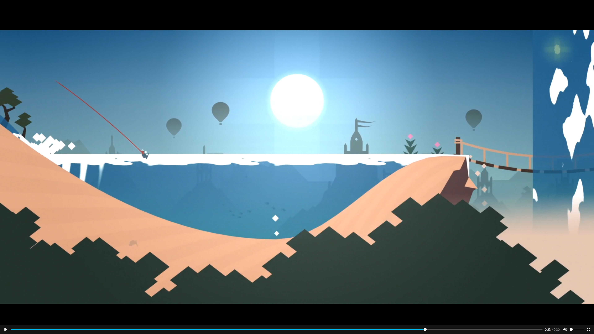

1 地形生成规则

    前景资源

    随机种子

    原始地形点:
        沙地
        草地
        岩石
        水坑

2 人物移动

高山的两边生成旋风，可以把玩家吹上去 旋风一开始只有一小朵，游玩家交互旋转可以越变越大

矢量图网站:
https://www.vector4free.com/flat-design-dia-de-muertos-background-41416
https://www.freevector.com/
https://www.vecteezy.com/free-vector/desert
https://www.freepik.com/search?format=search&last_filter=query&last_value=desert&query=desert&type=vector