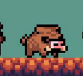
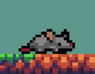

玩家职业:根据羁绊各一种

去不同的遗迹,曾经有无数的英雄为了击退怪物再次陨落,你可以召唤沉睡的英灵为你战斗,以及入口出有一些英灵守卫，他们可以帮助你

道具挑战是比较重要的，让玩家自己选

英雄类型，共做48种

炼金术士，投掷药水瓶 造成区域中毒效果
元素术士，投掷药水炸弹，造成区域元素爆炸效果
牧师 创建一个区域恢复英雄生命

忍者 能出飞镖 能弹射
精灵 射出魔法弓箭 有几率定住目标
冰雪女王 射出的弓箭让怪物减速
圣骑士 增强队伍防御力
丛林祭司 放置一个图腾柱 每次经过图腾柱时会获得加成
丛林战士 放置捕兽夹 减速并破甲
火焰骑士 攻击附带持有火属性伤害
钢铁骑士 攻击有几率击晕目标
魔龙骑士 击退效果增强
小丑男 
小丑女
南瓜人 拿火杖
奥术法师 身体周围扩散雷电
白袍法师 身体周围环绕火球
混沌骑士 触发随机效果
腐蚀者 击杀敌人时，生成两个帮手

特色：
敌人减速    冰霜射手
持续伤害    南瓜人 火杖持续伤害
队伍防御力 圣骑士
移动速度 钢铁骑士
暴击获得金币
队伍暴击加成
范围治疗    治愈牧师
攻击速度    狂暴牧师
电散射攻击  奥术
雷电球环绕攻击 奥术大师
图腾加成    丛林大祭司
弓箭攻击弹射 丛林射手 穿梭箭
法球攻击弹射
区域中毒    炼金术士-毒
区域爆炸 将敌人分散开 炼金术士-火
持续回血
小型黑洞 将附近的敌人拉拢进来   虚灵术士
攻击力成长  虚灵战士
攻击速度成长    虚灵射手
生命值成长  虚灵之盾
远程大幅击退    重弩射手
散射弓箭射击    散射射手
散射法球攻击    
法球爆炸 
沉默之箭
刺棍攻击 会飞溅刺出来 丛林战士
冲锋战士受到攻击时爆炸 火焰骑士
最后一滴血时无敌3秒 并且暴击几率翻倍 龙战士
拉爆炸屎
扔屎 屎族 三颗屎会触发爆炸效果

火焰属性可以蔓延
刺棍单纯流血伤害

羁绊类型:
    战士 增加防御力
    游侠 快速攻击
    侠盗 增加暴击几率
    法师 
    治疗师 
    爆炸
    虚空使者 有几率吸收伤害
    骑士 队伍移动速度加成
    异能者
    丛林 生命吸取
    召唤师
    屎族 三颗屎会触发爆炸效果
    元素 冰和火都有元素羁绊

挑战不同的洞穴
不同的洞穴有不同的buff加成

队伍属性
移动速度

英雄属性
血量
防御力 受到伤害为 原本伤害*(1 - (防御力)/(24+防御力))
物理攻击力
魔法攻击力
攻击速度 直接读取技能的显示
近战攻击范围加成
远程攻击触发范围加成

怪物属性
血量
攻击力
近战攻击范围
远程攻击触发范围
移动速度

https://assetstore.unity.com/packages/2d/characters/pixel-monsters-animated-pack-1-259474
https://assetstore.unity.com/packages/2d/characters/pixel-monsters-animated-pack-2-260721
https://assetstore.unity.com/packages/2d/characters/pixel-monsters-vol-2-226069
https://raharlpixel.itch.io/undead-pixel-monster-pack
https://rvros.itch.io/pixel-monsters
https://www.bilibili.com/read/cv22661537/
https://zhuanlan.zhihu.com/p/619020245
https://www.bilibili.com/read/cv11433016

不适合像土豆兄弟一样满屏刷怪
像snkrx聚合怪
不要做怪物死亡后释放技能

和玩家一样的蛇形怪物,最多三节 腐败灵魂 普通英雄

要主做法师类怪物 范围区域伤害

超大火球直线攻击

多余的怪可以放在不同的地图 不能使用猪做怪物

可做分裂,不要做召唤

冲锋怪 野猪

火焰脑袋环形旋转的怪物 精英

死亡会爆炸的蜘蛛

血超级厚的木桩

吐孢子的蘑菇怪

怪物类型
* 1 老鼠 移动速度快 血量低

* 2
  
  普通怪
  普通移动速度近战攻击 普通血量
  快速移动速度近战攻击 低血量
  普通移动速度射击攻击 普通血量 会风筝
  普通移动速度冲撞攻击 普通血量
  普通移动速度散射攻击 普通血量 前摇较长 提前击毙
  火炮怪 一直躲墙角 发送巨型火球

  强力怪 普通怪的加强版
  厚血的普通怪
  厚学的冲锋怪

  <!-- 成长型怪物 体型逐渐变大 生命值也提高 -->
  祭祀怪物 一个脑袋在地面上，地下有圆圈走进度，走完后变身成完整的怪物

  辅助怪 让玩家优先击杀
  buff怪,恢复周围怪物血量
  buff怪,让周围怪物增加攻击力血量速度

  奖励怪 掉落更多金币

  大头冲锋怪

狂鸟天天 天天姐姐，我是一个18纯情男高独立开发者，我缝合了土豆兄弟和snkrx这两个游戏，天天姐姐能玩玩我的作品吗,不用推广,单纯玩玩,不好玩的话退款,还行的话给我些意见,以及正式版也会将你写进感谢名单